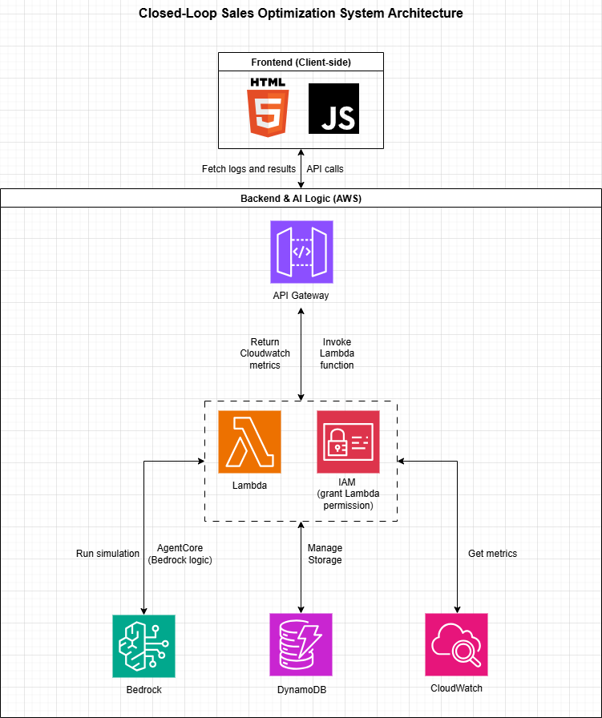

# Closed-Loop Sales Optimization Agent 

An AWS Bedrock-powered AI agent that tests prices, simulates demand, and adapts in real time: a closed-loop system for sales optimization.



## Inspiration

Driven by traditional revenue management principles and modern AI automation opportunities.
Inspired by enterprise pricing teams seeking faster, data-driven decision loops.

## What it does

Autonomously tests pricing strategies, simulates demand response, and optimizes sales outcomes continuously.
Closes the loop through real-time feedback and adaptive decisioning.

## How we built it

Architected an AWS Bedrock–powered agent with simulation logic and scalable backend services.
Integrated pricing experiments, monitoring, and policy updates into a unified workflow.

## Challenges we ran into

Balancing exploration versus revenue stability under limited simulated demand signals.
Designing interpretable outputs from probabilistic model behavior.

## Accomplishments that we're proud of

Delivered a functional closed-loop pricing prototype under hackathon constraints.
Demonstrated enterprise-ready architecture with extensible optimization logic.

## What we learned

Closed-loop systems demand disciplined assumptions and strong observability.
AI agents perform best when grounded in classic pricing fundamentals.

## What's next for Closed-Loop Sales Optimization Agent

Expand to multi-product optimization and richer demand signals.
Prepare for real-world data integration and controlled deployment pilots.

## Deployment / GitHub Pages

This repository contains a simple static site consisting of `index.html`, `server.js`, `simulation.js`, and `src/styles.css`.

To have GitHub Pages serve the repository root (so `index.html` in the repo root is used), go to your repository's Settings → Pages and set the source to `main` branch and folder `/ (root)`.

To preview locally, you can run the included server:

```powershell
npm install
node server.js
```

Then open http://localhost:3000 in your browser.
